# PPOCR Workbench

PPOCR Workbench 是一个面向 PaddleOCR / PaddleX 的本地离线 OCR 工作台，用来把图片/PDF 导入、自动预标注、人工校验、数据集导出、训练、模型版本管理和预测验证串成一条闭环。

当前主实现为 C++ / Qt / QML / QSS / CMake，旧 Python UI 已退役。`run_labeler.py` 只作为兼容启动器保留，用来构建并启动 C++ 工作台。

## UI 界面预览

所有 UI 截图统一放在 `docs/images/` 目录。

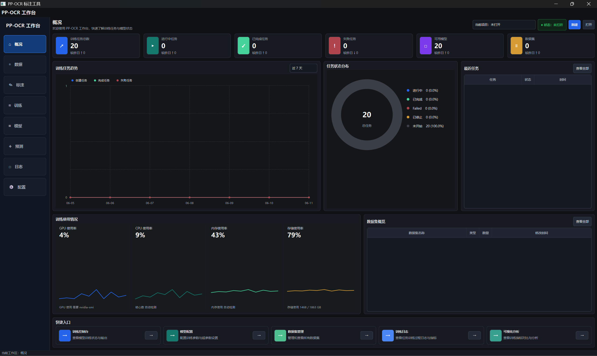

<table>
  <tr>
    <td width="50%">
      <strong>项目概况</strong><br>
      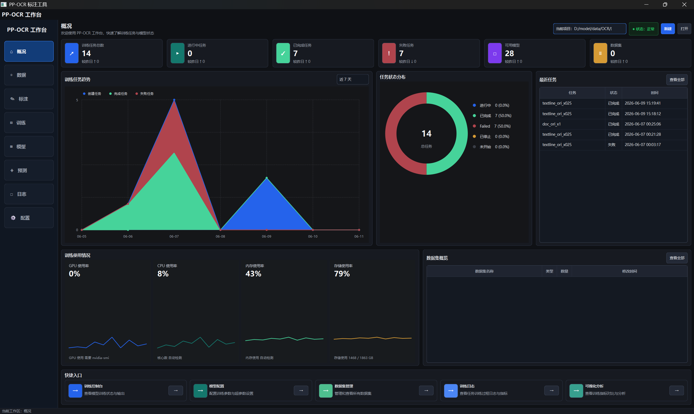
    </td>
    <td width="50%">
      <strong>数据集管理</strong><br>
      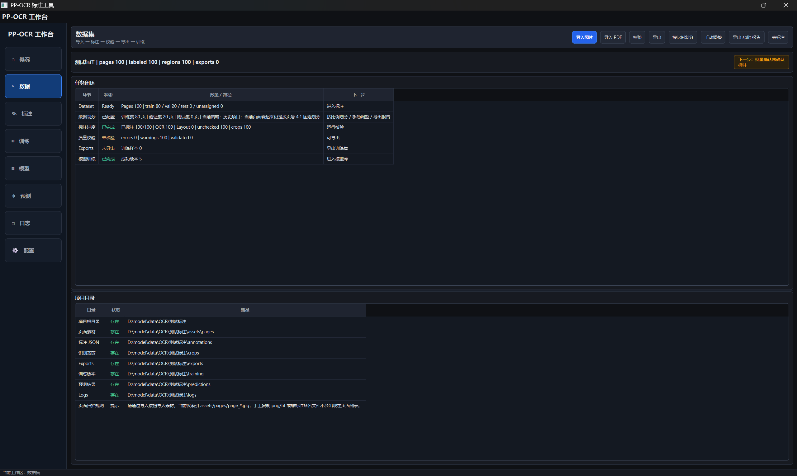
    </td>
  </tr>
  <tr>
    <td width="50%">
      <strong>标注工作台</strong><br>
      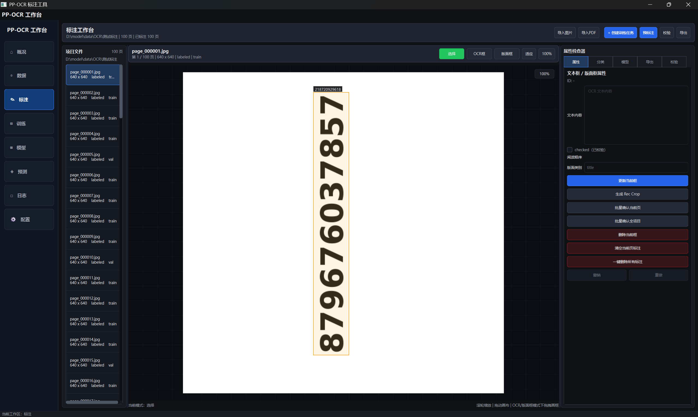
    </td>
    <td width="50%">
      <strong>训练任务列表</strong><br>
      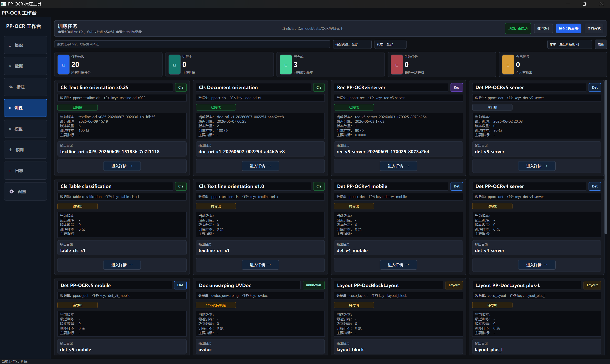
    </td>
  </tr>
  <tr>
    <td width="50%">
      <strong>训练配置与指标</strong><br>
      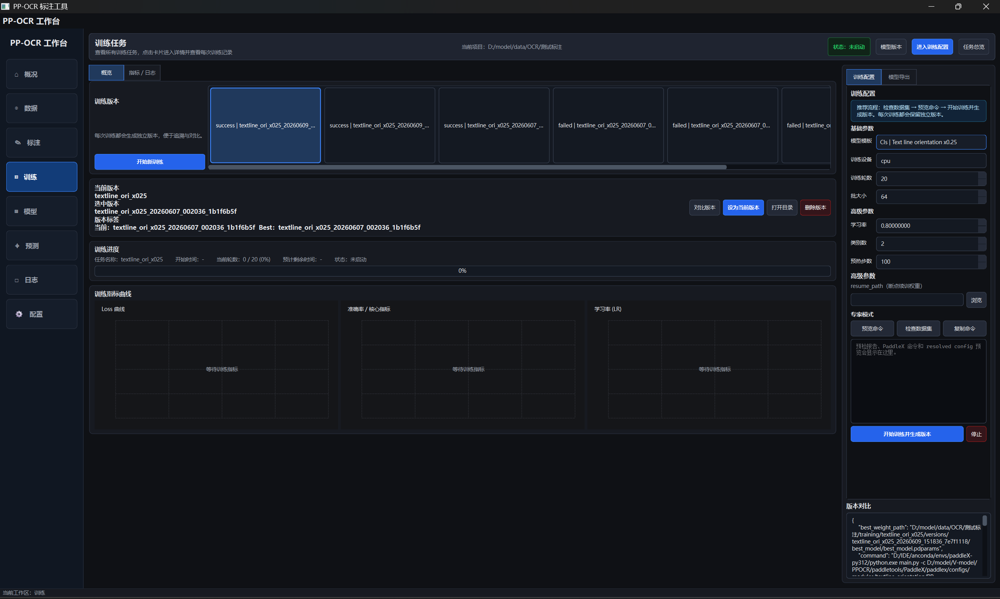
    </td>
    <td width="50%">
      <strong>训练版本</strong><br>
      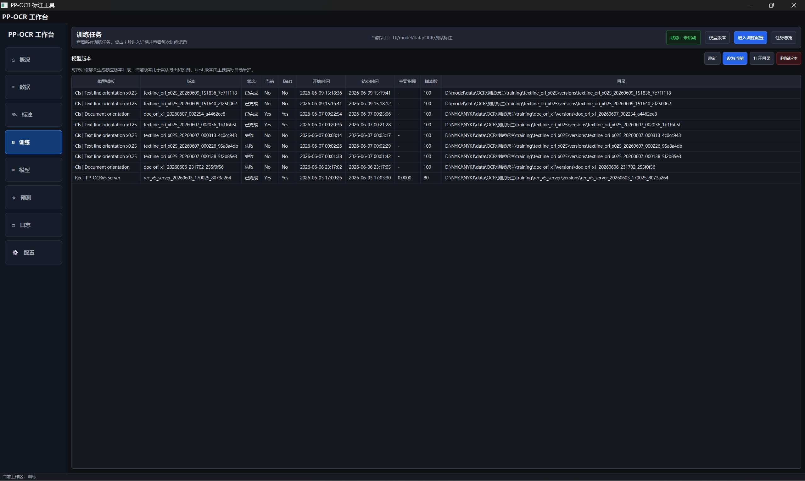
    </td>
  </tr>
  <tr>
    <td width="50%">
      <strong>模型库</strong><br>
      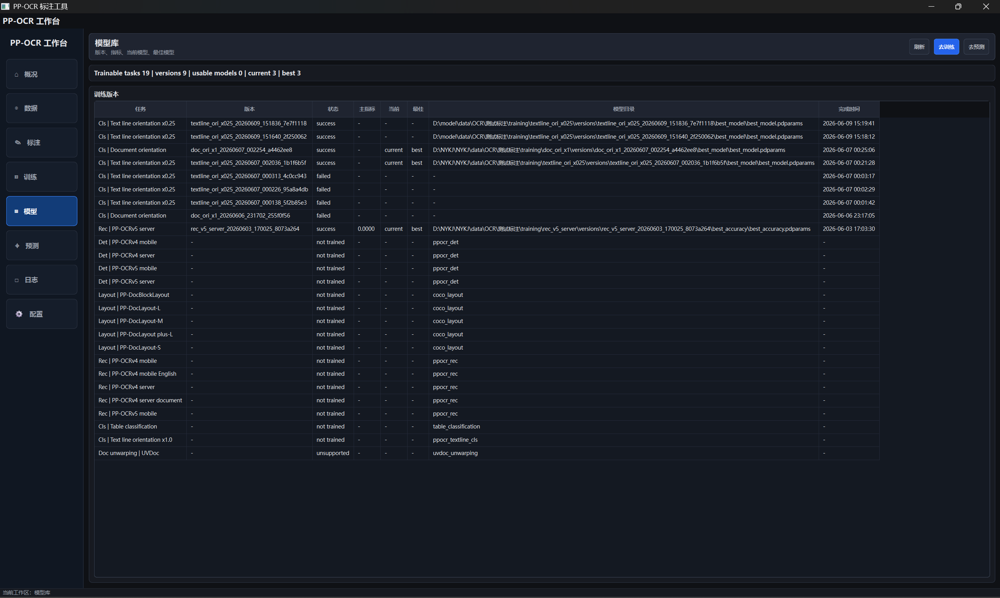
    </td>
    <td width="50%">
      <strong>预测工作台</strong><br>
      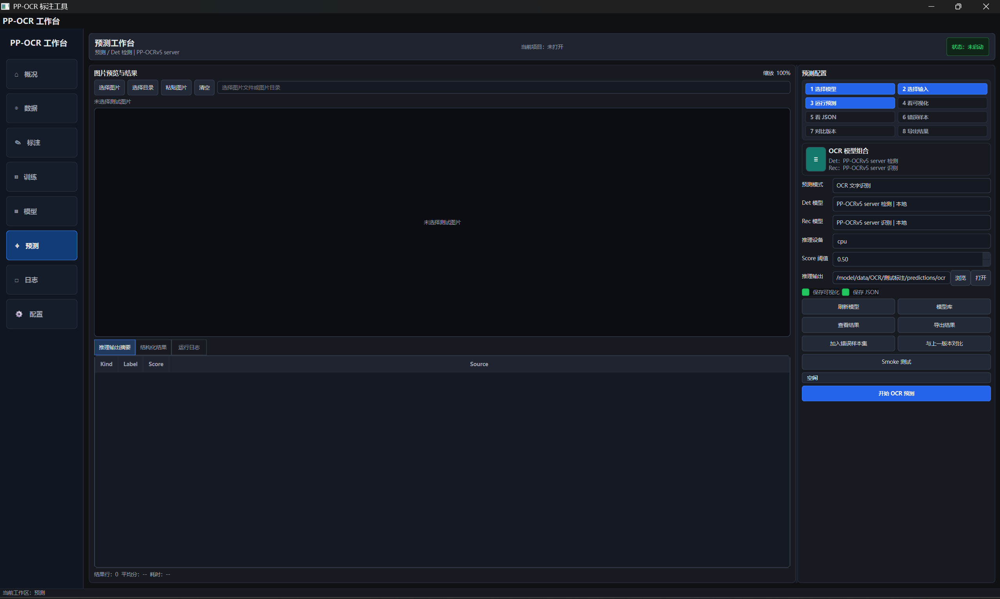
    </td>
  </tr>
  <tr>
    <td width="50%">
      <strong>日志</strong><br>
      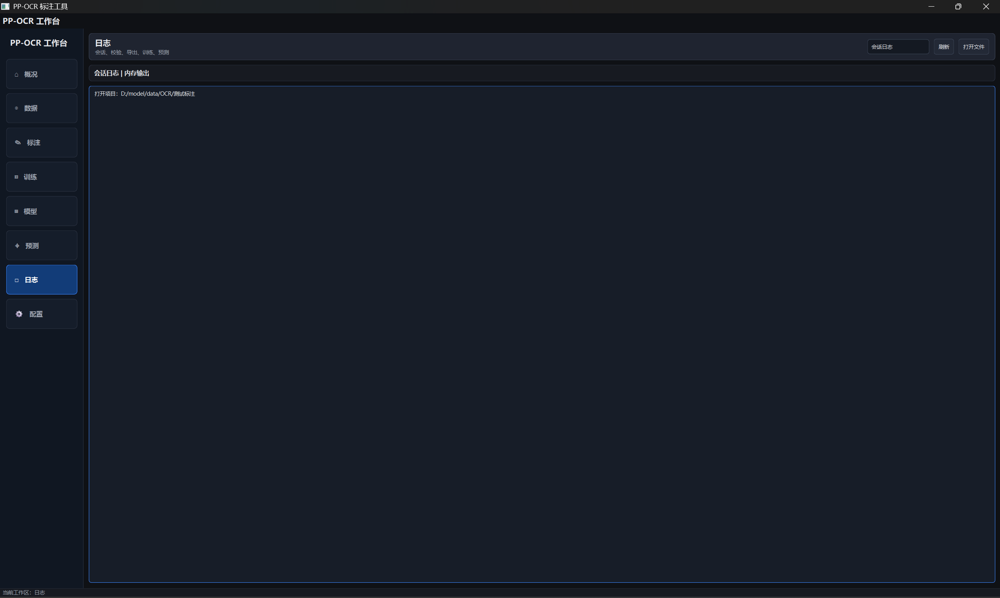
    </td>
    <td width="50%">
      <strong>配置与环境报告</strong><br>
      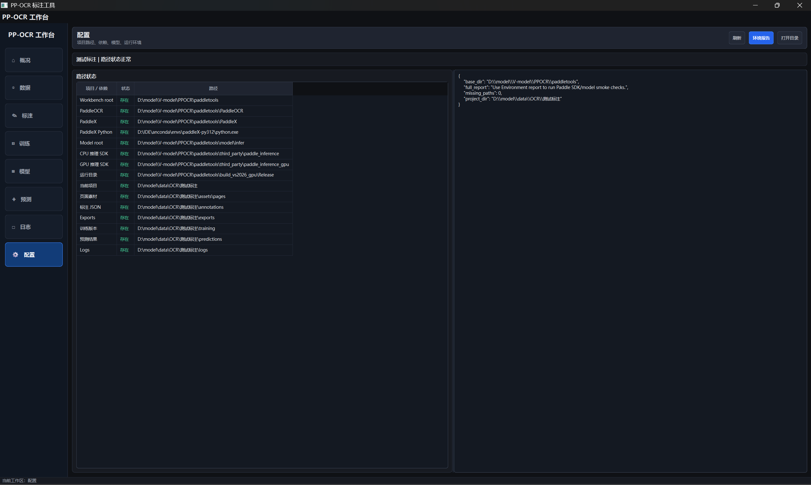
    </td>
  </tr>
</table>

## 核心能力

| 模块 | 能力 |
| --- | --- |
| 项目 | 新建/打开项目，记录最近项目，管理项目目录结构 |
| 数据 | 导入图片和 PDF，生成标准页面图、缩略图和 annotation 文件 |
| 标注 | OCR 文本框、Layout 区域、图片级分类标签、撤销/重做、checked/ignore |
| 预标注 | C++ Paddle Inference OCR、分类、版面预测写回 annotation |
| 校验 | 检查图片、区域点位、文本、label、reading order 和导出前错误 |
| 导出 | PaddleOCR det/rec/cls、textline cls、table cls、COCO layout |
| 训练 | PaddleX 训练 preflight、任务选择、命令生成、日志和指标解析 |
| 模型 | current/best 版本记录，训练版本目录和指标归档 |
| 预测 | OCR、分类、Layout 预测，支持文件/目录输入和结果发布 |
| 工具 | 环境检查、workflow smoke、训练/预测 CLI、打包脚本 |

## 推荐工作流

```text
新建项目
-> 导入图片/PDF
-> 自动预标注
-> 人工确认 checked
-> 校验项目
-> 导出训练数据集
-> 训练 preflight
-> 启动 PaddleX 训练
-> 查看日志和指标
-> 管理模型版本
-> 单图/目录预测验证
-> 导出预测结果或部署资产
```

## 目录结构

```text
paddletools/
  src/                         C++ 主源码
    app/                       Qt GUI、窗口、页面、controller
    application/               应用服务编排层
    domain/                    领域对象和强类型状态
    core/                      项目、标注、校验、导出、训练核心逻辑
    paddle/                    Paddle Inference / PaddleX 桥接
    infrastructure/            文件系统、JSON、日志、环境检测
  qml/                         QML 标注画布
  resources/                   Qt resource、QSS token/theme、训练任务 manifest
  tools/                       C++ CLI 和 smoke 工具
  tests/                       C++ 回归测试
  scripts/                     构建验证、打包、环境脚本
  docs/images/                 README 和文档图片
  model/                       本地模型目录，通常不纳入版本管理
  PaddleOCR/ PaddleX/          本地外部依赖源码，通常不纳入版本管理
  third_party/                 Paddle Inference 等 SDK，通常不纳入版本管理
```

## 快速启动

如果已经有本地 Release 构建：

```powershell
.\build_vs2026\Release\ppocr_workbench.exe
```

打开指定项目：

```powershell
.\build_vs2026\Release\ppocr_workbench.exe --project D:\path\to\project
```

打开最近项目：

```powershell
.\build_vs2026\Release\ppocr_workbench.exe --last
```

兼容启动器：

```powershell
python .\run_labeler.py
```

`run_labeler.py` 会优先查找 GPU 构建，再查找 CPU 构建，最后查找打包目录：

```text
build_vs2026_gpu/Release/ppocr_workbench.exe
build_vs2026/Release/ppocr_workbench.exe
dist/ppocr_workbench/ppocr_workbench.exe
```

如需固定启动某个 exe：

```powershell
$env:PPOCR_WORKBENCH_EXE="D:\path\to\ppocr_workbench.exe"
python .\run_labeler.py
```

## 环境变量

仓库里的 `CMakePresets.json` 不写死个人机器路径，优先从环境变量和 `CMakeUserPresets.json` 读取本机配置。

| 变量 | 用途 |
| --- | --- |
| `QT_ROOT` | Qt 安装根目录，例如 `D:\Qt\6.x.x\msvc2022_64` |
| `OpenCV_DIR` | OpenCV CMake package 目录 |
| `OPENCV_RUNTIME_DIR` | OpenCV DLL 目录，未设置时会尝试由 `OpenCV_DIR` 推断 |
| `PPOCR_PADDLE_INFERENCE_ROOT` | Paddle Inference C++ SDK 根目录 |
| `PPOCR_PADDLEX_PYTHON` | PaddleX/PaddleOCR 训练用 Python |
| `PPOCR_BASE_DIR` | 运行时显式指定项目源码/资源根目录 |
| `PPOCR_WORKBENCH_EXE` | `run_labeler.py` 固定启动的工作台 exe |
| `PPOCR_SKIP_REBUILD` | 设为 `1` 时，兼容启动器跳过自动构建 |

示例：

```powershell
$env:QT_ROOT="D:\path\to\Qt\6.x.x\msvc2022_64"
$env:OpenCV_DIR="D:\path\to\opencv\lib"
$env:OPENCV_RUNTIME_DIR="D:\path\to\opencv\bin"
$env:PPOCR_PADDLE_INFERENCE_ROOT="D:\path\to\paddle_inference"
$env:PPOCR_PADDLEX_PYTHON="D:\path\to\python.exe"
```

如果要长期保存本机配置，请新建 `CMakeUserPresets.json`，不要把本机绝对路径写回 `CMakeLists.txt` 或 `CMakePresets.json`。

## 构建

CPU Release：

```powershell
cmake --preset vs2026-release
cmake --build --preset release
```

GPU Release：

```powershell
cmake --preset vs2026-gpu-release
cmake --build --preset release-gpu
```

通用 Windows MSVC preset：

```powershell
cmake --preset windows-msvc-release
cmake --build --preset windows-msvc-release
```

VS Code 中优先使用这些任务：

```text
PPOCR: run labeler
C++: run workbench
C++: verify workbench
C++: verify packaged workbench
C++: workflow smoke
C++: workflow smoke with OCR
C++: environment check
```

常用调试配置：

```text
Debug C++ Workbench
Debug C++ Workbench Last Project
```

## 验证

默认完整验证：

```powershell
powershell -ExecutionPolicy Bypass -File .\scripts\verify_cpp_workbench.ps1
```

只跑 CTest：

```powershell
ctest --test-dir .\build_vs2026 -C Release --output-on-failure
```

打包验证：

```powershell
powershell -ExecutionPolicy Bypass -File .\scripts\verify_cpp_workbench.ps1 -Package
```

真实 PaddleX 短训练探针：

```powershell
powershell -ExecutionPolicy Bypass -File .\scripts\verify_cpp_workbench.ps1 -TrainingProbe -TrainingProbeTimeoutSeconds 120
```

C++ 环境报告：

```powershell
.\build_vs2026\Release\ppocr_env_check.exe --base-dir . --report .\build_vs2026\environment_report.json
```

补齐 table classification 官方推理模型：

```powershell
powershell -ExecutionPolicy Bypass -File .\scripts\download_table_cls_model.ps1
```

## 命令行工具

构建后，`build_vs2026/Release` 下会生成这些辅助工具：

| 工具 | 用途 |
| --- | --- |
| `ppocr_workbench.exe` | C++/Qt GUI 工作台 |
| `ppocr_env_check.exe` | 输出 Qt/OpenCV/Paddle/PaddleX 环境报告 |
| `ppocr_infer_smoke.exe` | Paddle Inference SDK 和模型 smoke |
| `ppocr_ocr_predict.exe` | OCR 预测 CLI |
| `ppocr_cls_predict.exe` | 分类预测 CLI |
| `ppocr_layout_predict.exe` | Layout 预测 CLI |
| `ppocr_training_preflight.exe` | 训练前检查、数据集导出、任务列表 |
| `ppocr_training_run.exe` | 启动训练或模拟训练 |
| `ppocr_workflow_smoke.exe` | 端到端项目/导入/标注/导出/训练 smoke |

列出训练任务：

```powershell
.\build_vs2026\Release\ppocr_training_preflight.exe --list-tasks
```

端到端 smoke：

```powershell
.\build_vs2026\Release\ppocr_workflow_smoke.exe
```

带真实 OCR 预标注写回验证：

```powershell
.\build_vs2026\Release\ppocr_workflow_smoke.exe --with-ocr
```

## 打包

```powershell
powershell -ExecutionPolicy Bypass -File .\scripts\package_workbench.ps1
```

默认输出目录：

```text
dist/ppocr_workbench
```

该目录会包含 GUI、预测/训练/smoke 工具，以及 Qt、OpenCV、Paddle Inference 运行时 DLL。

## 项目数据结构

一个标注项目大致如下：

```text
project/
  project.json
  assets/
    raw/                    原始导入文件
    pages/                  标准页面图 page_XXXXXX.jpg
    thumbs/                 缩略图
  annotations/              每页一份 page_XXXXXX.json
  crops/                    识别 crop 和预览
  exports/                  PaddleOCR/PaddleX/COCO 导出结果
  training/                 runs、versions、训练产物
  cache/                    预标注和预测临时缓存
  predictions/              预测发布结果
  logs/                     validate/export/training 日志
```

请优先通过工作台“导入”流程添加素材。当前页面扫描以 `assets/pages/page_*.jpg` 为标准入口，手工复制非标准命名文件可能不会出现在页面列表中。

## 重要行为

- 自动 OCR/Layout 预标注生成的 region 默认 `checked=false`，默认导出和训练 preflight 只使用 `checked=true` 的标注。预标注后请先人工检查并确认 checked，再进入训练。
- 导出会重建对应的任务输出目录，例如 `exports/ppocr_det`、`exports/ppocr_rec`。不要把重要外部目录当作导出目标。
- 新导入页面当前按页号规则分配 split，常规规则是约 4:1 的 train/val 分布。
- PaddleX 训练依赖 `PPOCR_PADDLEX_PYTHON` 指向的 Python 环境；只做 GUI 标注和 C++ 推理时可以不配置训练 Python。
- `model/`、`third_party/`、`PaddleOCR/`、`PaddleX/`、`build*/`、`dist/`、`training/` 等目录通常是本机依赖或生成产物，不建议直接纳入源码版本管理。
